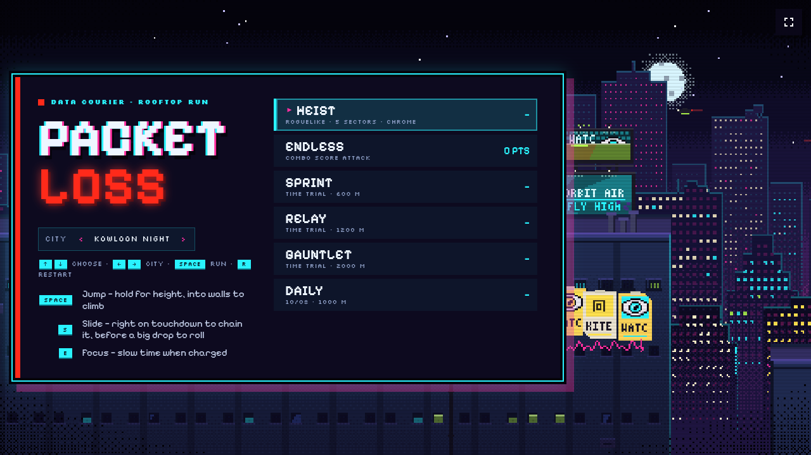
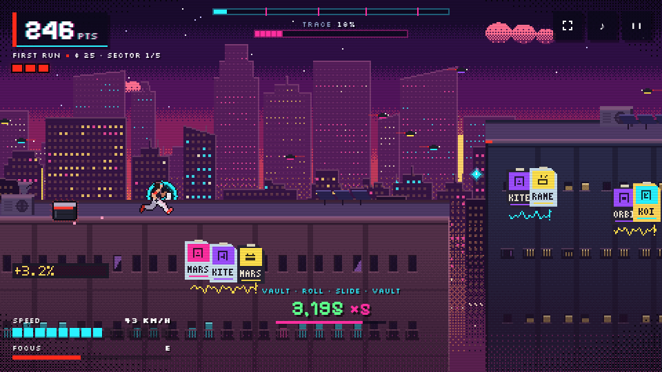
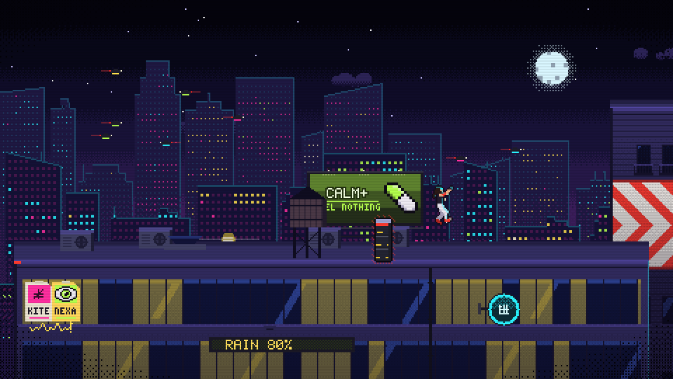
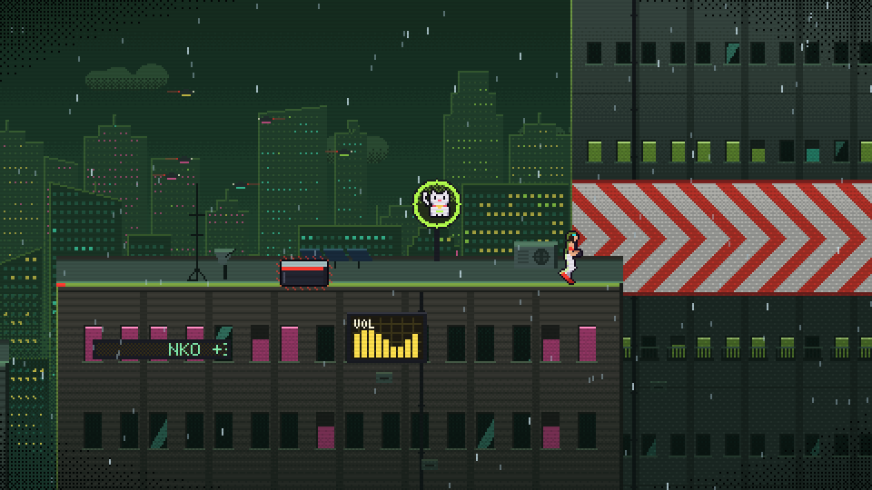
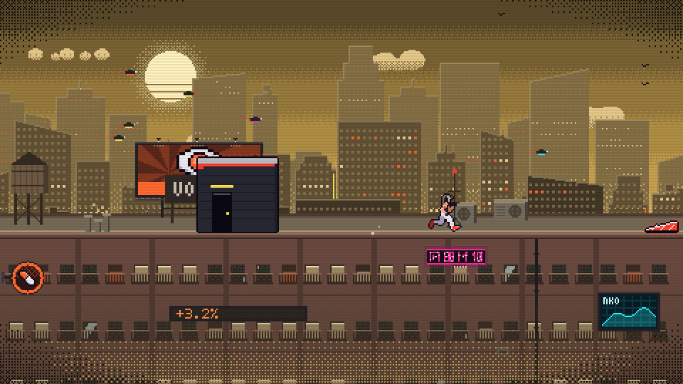
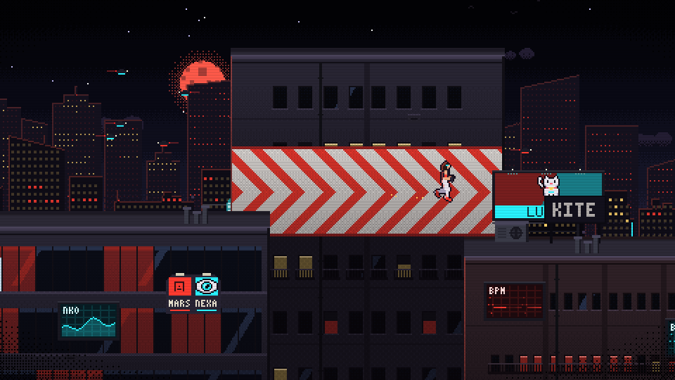

# Packet Loss

**[Play it in your browser →](https://snowu.github.io/packet-loss/)**



A cyberpunk side-scrolling rooftop runner with Mirror's Edge–style movement. You auto-run across a procedurally generated city and keep your momentum by vaulting, sliding, rolling out of drops, grabbing ledges, climbing walls, wall-running, riding ziplines and launching off springboards. The city is cyberpunk, with five district palettes: Neon Dusk, Kowloon Night, Acid Rain, Smog Noon and a red-moon Blackout. Pick one on the title screen, or choose Drift to pass through them all as you run. Weather comes and goes on its own: rain rolls in, fog thickens between the skyline layers and the city fades into haze.

| | |
|---|---|
|  |  |
| *Heist: data shards, laser grids and the trace meter* | *Kowloon Night: posters, an LED ticker and a rooftop billboard* |
|  |  |
| *Acid Rain, mid-storm* | *Smog Noon: screens, neon and a rooftop board* |
|  | |
| *Blackout* | |

## Modes

- **Heist** is the roguelike run. You're a data courier crossing five sectors of city, one district each, on a fresh random seed every time. Corp security **traces** you while you run. It builds more slowly at full speed and every clean move knocks it back, while tripped laser grids and drones that spot you push it up, so a careful, fast run stays hidden and mistakes are what burn you. When it fills, ICE burns a point of integrity. Security wears one livery: magenta is armed (keep out of beams and drone scans), amber is an alarm you already set off, cyan is data. Grab cyan **data shards** for creds, slide under or jump over **laser grids**, and jump into hovering **drones** for a takedown, or clear them overhead; running underneath gets you spotted. At the uplink between sectors a **street doc** offers three pieces of chrome; one is free, and creds buy repairs and rerolls. Falls and ICE burns cost integrity, and losing it all flatlines the run. Extracting with integrity left pays a bonus.
- **Time Trials** (Sprint 600 m, Relay 1200 m, Gauntlet 2000 m, plus a Daily course seeded by the date). Each trial is a fixed-seed course, identical on every attempt, so times are comparable. The clock counts up, checkpoint splits show green/red deltas against your personal best, and your best run plays back as a cyan ghost. Medals are gold, silver and bronze; silver is the autopilot's time, so it's provably reachable, and gold needs real flow. The Daily is a new 1000 m course every day, the same for everyone on that date; it's picked when you start a run, and its medals are set by timing the autopilot on it in the background the first time you open the game that day.
- **Endless** is a combo score attack on a fresh random city every run. Every move feeds a combo whose multiplier grows with each chained move and scales with your speed. Keep moving to bank it; a hard landing, a bonk or a fall throws the combo away. Distance also scores, more when you're fast. You have three lives.

Falling never ends a trial. You respawn at the last checkpoint and the clock keeps running, so mistakes cost time. In Endless, a fall also costs a life and your current combo.

### Chrome

| Chrome | Effect |
|---|---|
| Reinforced Tendons *(rare)* | A mid-air jump |
| Overclocked Calves | Higher top speed, faster acceleration (stacks ×3) |
| Pneumatic Ankles | Higher jumps (×2) |
| Kinetic Dampers | Survive harder drops, wider roll window (×2) |
| Gecko Grip | Longer ledge reach, stronger wall climbs (×2) |
| Tachyon Optics | Focus charges faster (×2) |
| Chrono Dilator *(rare)* | Focus slows time harder and lasts longer |
| Synaptic Buffer | Longer combo window (×2) |
| Subdermal Plating | +1 max integrity (×3) |
| Insulated Dermis | Lasers don't break combos and trip less trace |
| Ghost Protocol | Trace builds slower (×2) |
| Signal Jammer | Drones add less trace (×2) |
| Data Siphon | Shards are worth double and pull in from further away (×2) |

## Look

Everything is pixel art drawn in code on a low-resolution canvas, with a chiptune score. Facades, neon signage, billboards, sky traffic, props, skyline and sky are generated procedurally from curated palettes. The ads are a little world of their own: hand-drawn products and mascots (energy drinks, ramen, a lucky cat, an all-seeing eye), parody slogans and faux-kanji neon. Skyline towers carry rooftop billboards, spinning holo projections, round signs, cloth banners, live screens and LED tickers; the buildings you run on have street posters with graffiti, neon tube signs, screens and big rooftop boards. Each building gets its own window rhythm, lights come on in rooms and whole floors rather than scattered windows, and the lower floors sink into shadow so the rooftop you run on reads first. Obstacles get their own high-contrast treatment: dark outlined steel, red edges and a pulsing glow, so they read against busy rooftops. The next obstacle in your path lights up as you close in, and pipe banks you slide under carry a red band and strap at head height. The lane stays the calmest part of the frame: the runner has a thin halo off her outline, the skyline just above the roofline washes into haze, roof equipment that isn't an obstacle fades back, and the facades sink into shadow below the lane. The runner is a skeleton with springy joints and a simulated ponytail, rasterized into an outlined sprite at a stepped 24 fps.

## Setup

```bash
npm install
npm run dev
```

## Controls

| | Desktop | Touch | Gamepad |
|---|---|---|---|
| Jump (hold for height; hold into a wall to climb) | Space / W / ↑ | Right side of screen | A / Y |
| Slide, or roll if pressed just before a hard landing | S / ↓ / Shift | Left side of screen | B / X / stick down |
| Focus (slow time once the meter is charged) | E / F / Q | ◎ button | Shoulders / triggers |
| Pause · mute | Esc or P · M | Buttons | Start |
| Instant restart | R | Pause menu | Select |
| Menu | ↑ ↓ then Space · ← → city palette · Esc to leave results | Tap | D-pad |

## Movement

- **Vault**: press jump as you reach anything waist-high and you speed-vault it. Run into it without pressing and you trip, losing speed and your combo. Taller crates stop you dead until you climb them.
- **Slide**: duck under red-striped pipes. Running into one standing up makes you stumble.
- **Roll**: big drops cause a hard landing that kills your speed unless you press slide just before you land.
- **Landing slide**: on a normal landing, press slide right as your feet touch down (within a few hundredths of a second either side) to land straight into a slide with a speed boost and a combo move. Jump out of it as a slide jump and land into another to keep a chain going. It only boosts when you're fast (about 46 km/h and up with perfect timing) and the cleaner the timing the bigger the boost; otherwise it's a plain slide, which keeps your speed. While you fall, brackets close in on your landing spot and a diamond lights up inside the timing window (cyan for a landing slide, red when the landing will be hard and you should roll); a label tells you how it went: PERFECT, GREAT, GOOD, or EARLY, LATE, TOO SLOW.
- **Ledge grab / climb**: jump at walls to grab the edge, and hold jump to run up taller walls.
- **Jump pad**: the tallest walls have a red pad at the roof edge before them. Jump while you're on it and you launch clean over the wall, keeping your speed; jump before or after it and you'll have to grab the ledge and climb.
- **Wall-run**: jump at a red chevron wall to run along it, then jump again to kick off.
- **Zipline**: jump to catch red cables across wide gaps.
- **Springboard**: red ramps launch you up to taller roofs.

Anything you can use is painted runner-vision red. Puddles and broken neon reflections sit behind the front roof edge, equipment and feet have contact shadows, and surfaces dry gradually after rain stops.

## Code layout

- `src/sim/` is the pure, deterministic simulation with no rendering or DOM: player physics (`player.js`), seeded course generation with checkpoints and finish lines (`generator.js`), the heist run state with trace, pickups and hazards (`heist.js`), chrome upgrades (`chrome.js`), level streaming (`level.js`), trial tracks (`tracks.js`), combo scoring (`score.js`), ghost recording (`ghost.js`), and a lookahead autopilot (`bot.js`) that drives the title-screen demo, the traversal tests and the medal times.
- `src/pixel/` is the renderer: palettes, pixel buffers and dithering, sprite bakers, the skeletal runner sprite, and the view.
- `src/ui/`, `src/input.js` and `src/audio.js` are the HUD, the input layer (keyboard, touch and gamepad), and fully synthesized audio and music.

## Development

Installed apps check for new releases on launch, every minute while visible, and when returning to the app or reconnecting. A **NEW VERSION AVAILABLE / UPDATE NOW** prompt appears on the menu, pause screen or results; it never reloads an active run automatically. The version label also has a manual **CHECK UPDATES** button. Updating preserves saved records and settings. Existing installations need one normal refresh to receive this checker.

Production builds emit `version.json` and embed the same release ID in the game. GitHub Pages uses the deployment commit as the ID, so every deployment is discoverable even without changing the package version. Local builds use the Git commit, with `PACKET_LOSS_BUILD_ID` available for testing distinct releases. Update checks are disabled in the development server; use `npm run build` and `npm run preview` to test them.

- `npm test` runs physics unit tests, sprite and palette checks, generator invariants, scoring and ghost tests, and autopilot runs that drive the real physics through 2.5 km of several seeds and finish every trial within its silver time.
- `npm run build` creates the production build that GitHub Pages deploys.
- F4 (localhost) cycles clarity checks over the running game: the classic look from before the clarity pass, a value (grayscale) check and a squint (blur) check.
- `?seed=123` fixes the course seed. In development, F2 opens a tuning panel for physics and chase values.
- F3 opens the local art lab and freezes the current game until you return. It includes a live autopilot course, synchronized runner comparisons, every traversal pose, pipe variants, obstacle strips across all five districts, scenery, a matching dry/wet roof lighting scene, an effects preview with landing, launch and pickup triggers, every heist hazard state across the districts, and a trace-balance chart that runs a whole heist for the current seed with a careful autopilot and one that ignores hazards. Pause, step, change seeds, inspect collision boxes, and export native-resolution PNGs. F3 works in development and in a production build served on localhost (`npm run build` then `npm run preview`). You can also open `lab.html` directly on the local server.
